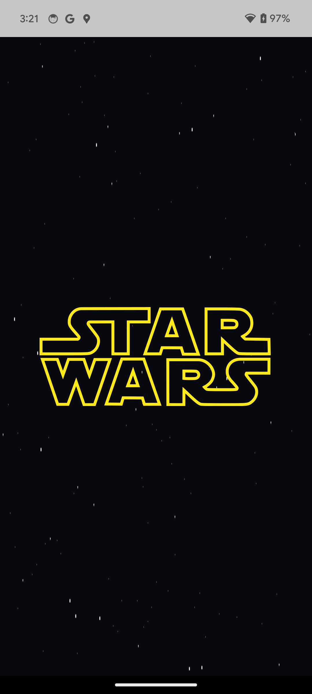
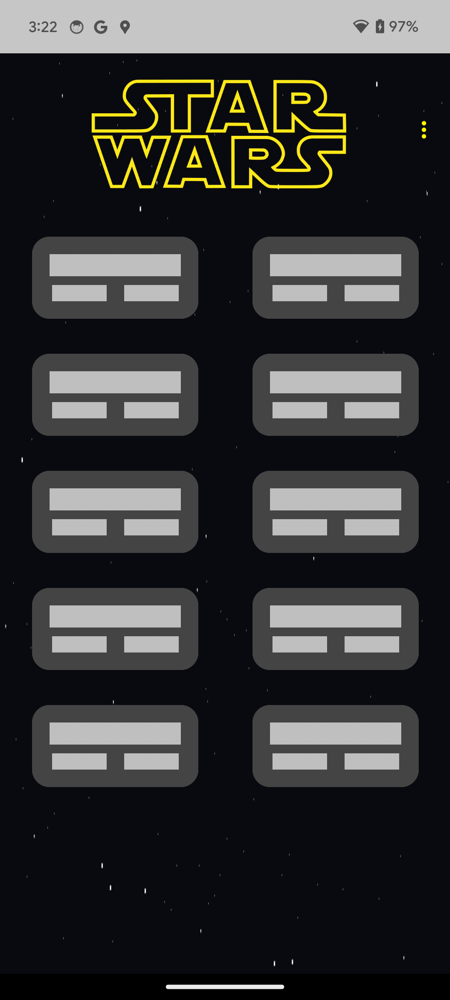
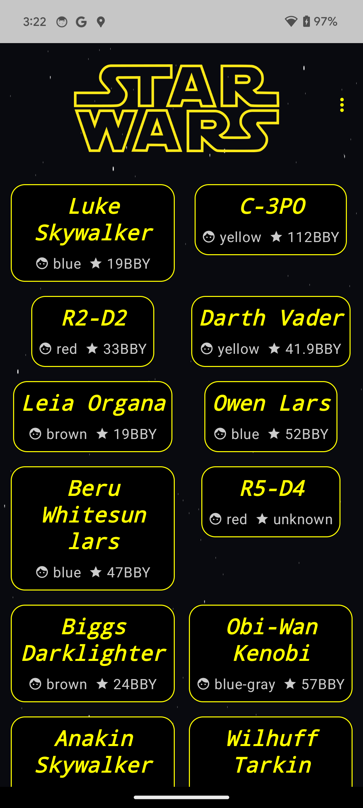
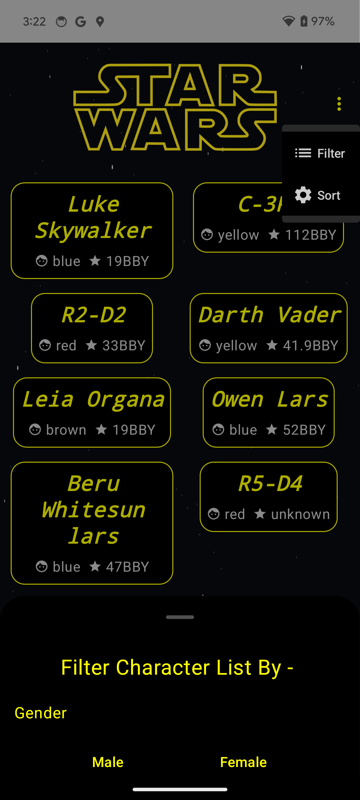
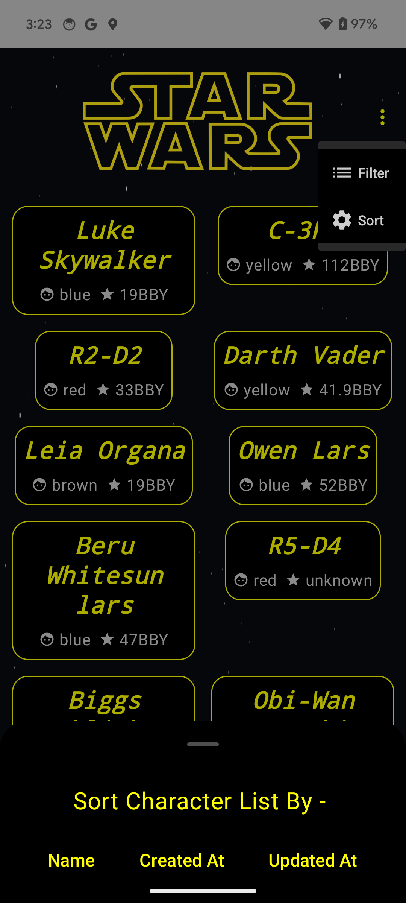
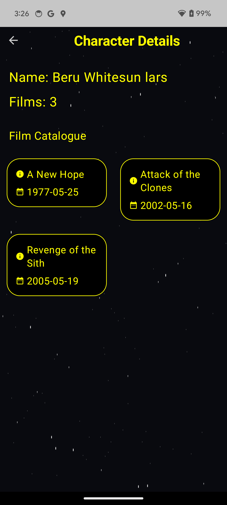

## The-Jedi-Journal: Discover Characters and Their Cinematic Journeys

**The-Jedi-Journal** is a mobile application that brings the beloved Star Wars universe to your fingertips. Explore a comprehensive database of characters, presented in a visually appealing grid view, and delve into their cinematic sagas with movie information.

**Features:**

* **Browse all Star Wars characters:** Discover hundreds of characters, from iconic heroes and villains to intriguing background figures, all organized in a user-friendly grid layout.
* **Character details at a glance:** Each character card displays essential information like name, eye color and their birth year.
* **Dive into movie history:** Tap on a character to unveil their complete movie appearances, listed chronologically with episode titles and release dates.
* **No spoilers, just facts:** Character descriptions remain spoiler-free, focusing on their official profiles and avoiding plot revelations.
* **Designed for convenience:** Simple and intuitive interface makes navigating the character database and exploring movie appearances effortless.
* **Pull to Refresh** the data from server.
* **Infinite Scrollable** List using custom Pagination.
* **Customise using Sort/Filter** View characters as you want, you can sort by `name`, `created_at` and `updated_at` and you can filter them by gender, `male` or `female`.

** App Snapshots **

     

**Tech Stack:**

* Programming Language: Kotlin 
* Data Source: A remote API `SWAPI (https://swapi.dev/)` to fetch Star Wars character data.
* Persistence: Room Database for caching retrieved character and films data locally.
* UI Framework: Jetpack Compose for building the intuitive and visually appealing UI.
* State Management: StateFlow for managing and exposing state changes in Star Wars character data to the UI efficiently.

**Getting Started:**

1. Clone the repository.
2. Run the application on your device or emulator.

**Contributing:**

We welcome contributions from Star Wars enthusiasts and developers alike! Feel free to fork the repository and share your improvements via pull requests.

**Disclaimer:**
This application is a fan-made project and is not affiliated with Lucasfilm Ltd. or Disney. All Star Wars characters and related materials are trademarks and copyrights of their respective owners.

**Let the Force be with you!**
